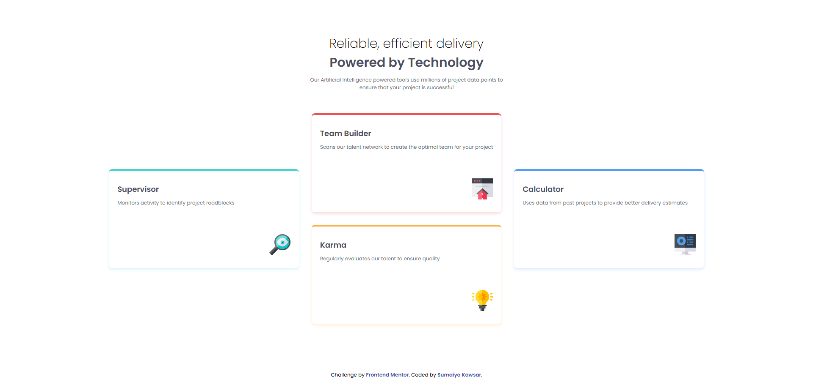

# Frontend Mentor - Four card feature section solution

  <h3>
    <a href="https://sumaiyakawsar.github.io/FrontendMentorsChallenges/Projects/13-four-card-feature-section">
      Demo
    </a>
     | 
    <a href="https://github.com/sumaiyakawsar/FrontendMentorsChallenges/tree/main/Projects/13-four-card-feature-section">
      Solution
    </a>
     | 
    <a href="https://www.frontendmentor.io/challenges/four-card-feature-section-weK1eFYK">
      Challenge
    </a>
  </h3>

 

 

## Overview

### The challenge

Users should be able to:

- View the optimal layout for the site depending on their device's screen size
 

### Screenshot

## My process

### Built with

- Semantic HTML5 markup
- SCSS
- CSS Grid

  
 
 
 
## Author

 