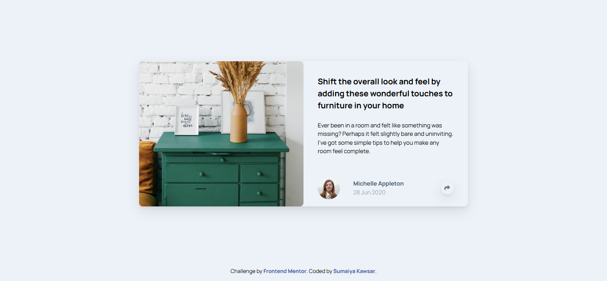

# Frontend Mentor - Article preview component 

  <h3>
    <a href="https://sumaiyakawsar.github.io/FrontendMentorsChallenges/Projects/15-article-preview-component">
      Demo
    </a>
     | 
    <a href="https://github.com/sumaiyakawsar/FrontendMentorsChallenges/tree/main/Projects/15-article-preview-component">
      Solution
    </a>
     | 
    <a href="https://www.frontendmentor.io/challenges/article-preview-component-dYBN_pYFT">
      Challenge
    </a>
  </h3>

 

 

## Overview

### The challenge

Your users should be able to:

- View the optimal layout for the component depending on their device's screen size
- See the social media share links when they click the share icon

### Screenshot

## My process

### Built with

- Semantic HTML5 markup
- SCSS

   
## Author

 