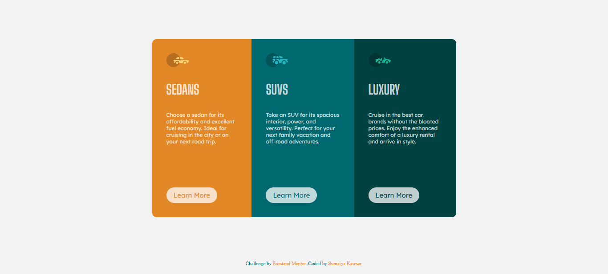

# Frontend Mentor - 3-column preview card component solution

  <h3>
    <a href="https://sumaiyakawsar.github.io/FrontendMentorsChallenges/Projects/2-3-column-preview-card-component/">
      Demo
    </a>
     | 
    <a href="https://github.com/sumaiyakawsar/FrontendMentorsChallenges/tree/main/Projects/2-3-column-preview-card-component">
      Solution
    </a>
     | 
    <a href="https://www.frontendmentor.io/challenges/3column-preview-card-component-pH92eAR2-">
      Challenge
    </a>
  </h3>

 

## Overview
 Frontend Mentor challenges help you improve your coding skills by building realistic projects. 

### The challenge

Users should be able to:

- View the optimal layout depending on their device's screen size
- See hover states for interactive elements

### Screenshot

## My process

### Built with

- Semantic HTML5 markup
- CSS custom properties
- CSS Flex

### What I learned

Using Flex properly.

## Author

 
