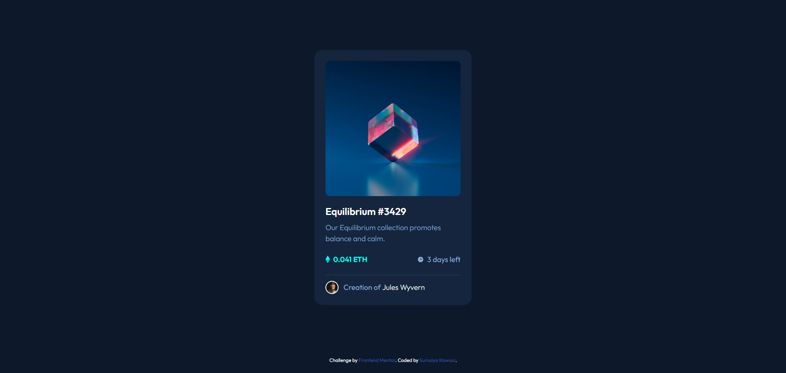

# Frontend Mentor - NFT preview card component

  <h3>
    <a href="https://sumaiyakawsar.github.io/FrontendMentorsChallenges/Projects/nft-preview-card-component">
      Demo
    </a>
     | 
    <a href="https://github.com/sumaiyakawsar/FrontendMentorsChallenges/tree/main/Projects/nft-preview-card-component">
      Solution
    </a>
     | 
    <a href="https://www.frontendmentor.io/challenges/nft-preview-card-component-SbdUL_w0U">
      Challenge
    </a>
  </h3>

## Overview
 This is my 9th challenge

### Screenshot

## My process

### Built with

- HTML5
- SCSS
- Flex

 
 
## Author

<!-- - Website - [Add your name here](https://www.your-site.com) -->

 