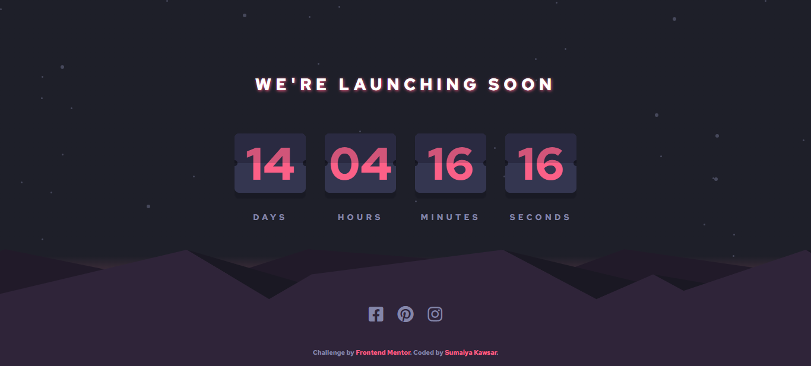

# Frontend Mentor - Launch countdown timer 

  <h3>
    <a href="https://sumaiyakawsar.github.io/FrontendMentorsChallenges/Projects/launch-countdown-timer/">
      Demo
    </a>
     | 
    <a href="https://github.com/sumaiyakawsar/FrontendMentorsChallenges/tree/main/Projects/launch-countdown-timer">
      Solution
    </a>
     | 
    <a href="https://www.frontendmentor.io/challenges/launch-countdown-timer-N0XkGfyz-">
      Challenge
    </a>
  </h3>

## Overview
 Frontend Mentor challenges help you improve your coding skills by building realistic projects. 

### The challenge

Users should be able to:

- See hover states for all interactive elements on the page
- See a live countdown timer that ticks down every second
- **Bonus**: When a number changes, make the card flip from the middle

### Screenshot

## My process

### Built with

- Semantic HTML5 markup
- SCSS
- Flexbox
- [gsap](https://greensock.com/gsap/) 

### What I learned

In this project, I have learned how to use gsap with html.

### Continued development

- Would love to make it more responsive.

 
  

## Author

 

## Acknowledgments

 I would love to thank [Competent Programming's](https://www.youtube.com/watch?v=t56nSwjozf0&ab_channel=CompetentProgramming) youtube video to help me out with the flip animation.

 
