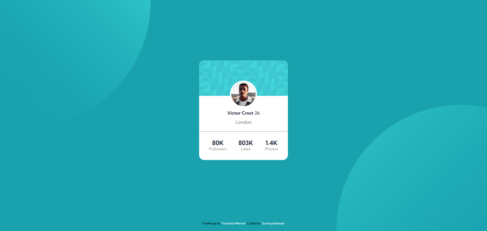

# Frontend Mentor - Blog Preview Card

  <h3>
    <a href="https://sumaiyakawsar.github.io/FrontendMentorsChallenges/Projects/profile-card-component">
      Demo
    </a>
     | 
    <a href="https://github.com/sumaiyakawsar/FrontendMentorsChallenges/tree/main/Projects/profile-card-component">
      Solution
    </a>
     | 
    <a href="https://www.frontendmentor.io/challenges/profile-card-component-cfArpWshJ">
      Challenge
    </a>
  </h3>

## Overview
 Frontend Mentor challenges help you improve your coding skills by building realistic projects. 

### Screenshot

## My process

### Built with

- Semantic HTML5 markup
- SCSS custom properties
- Flexbox

### What I learned
Nothing new. Just did this faster than before and no chatGPT

### Continued development

The more projects I complete the more I learn. 
 
## Author

<!-- - Website - [Add your name here](https://www.your-site.com) -->

 