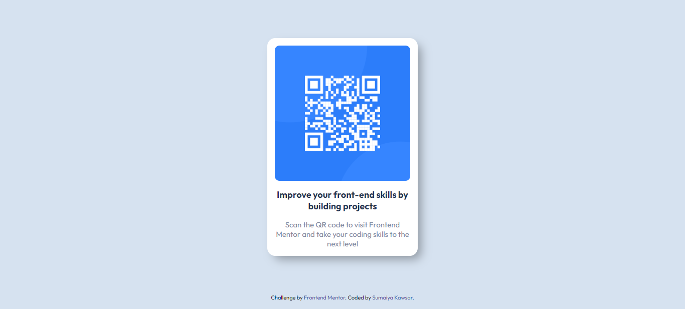

# Frontend Mentor - QR code component solution

  <h3>
    <a href="https://sumaiyakawsar.github.io/FrontendMentorsChallenges/Projects/qr-code-component-project/">
      Demo
    </a>
     | 
    <a href="https://github.com/sumaiyakawsar/FrontendMentorsChallenges/tree/main/Projects/qr-code-component-project">
      Solution
    </a>
     | 
    <a href="https://www.frontendmentor.io/challenges/qr-code-component-iux_sIO_H">
      Challenge
    </a>
  </h3>

## Overview
 Frontend Mentor challenges help you improve your coding skills by building realistic projects. 

### Screenshot

## My process

### Built with

- Semantic HTML5 markup
- SCSS custom properties
- Flexbox
<!-- - Mobile-first workflow -->

### What I learned
I have learned how to create and use functions in scss.  

### Continued development

The more projects I complete the more I learn. 
 
## Author

<!-- - Website - [Add your name here](https://www.your-site.com) -->

 